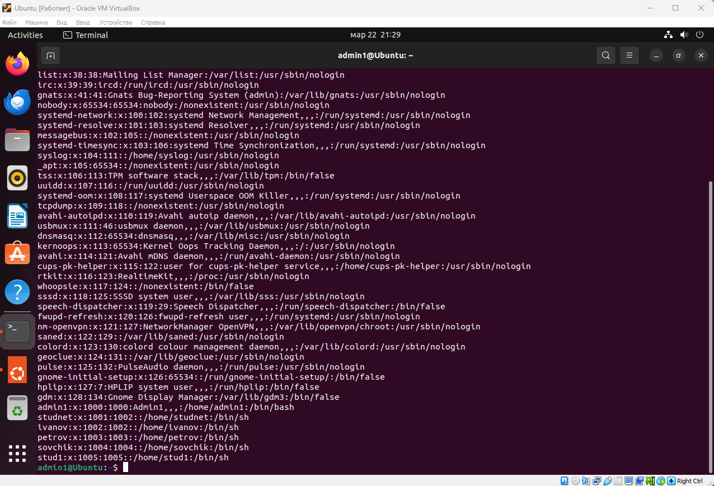
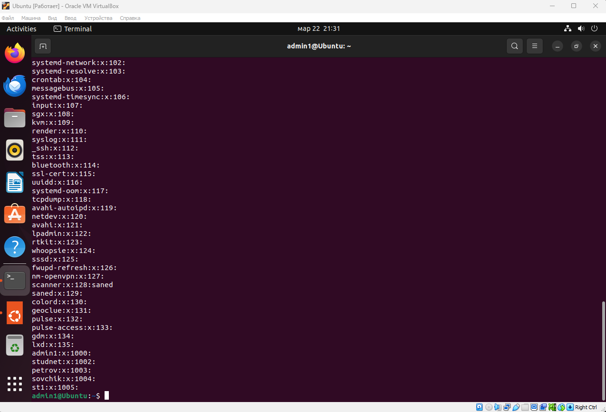
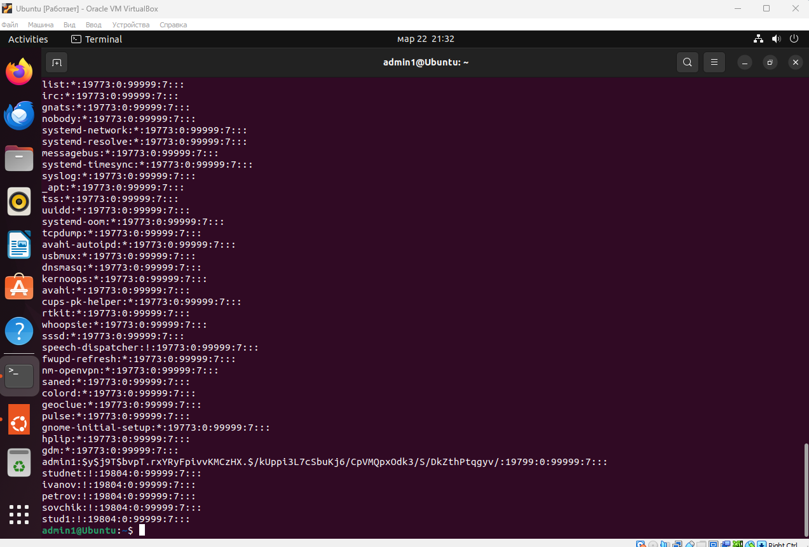
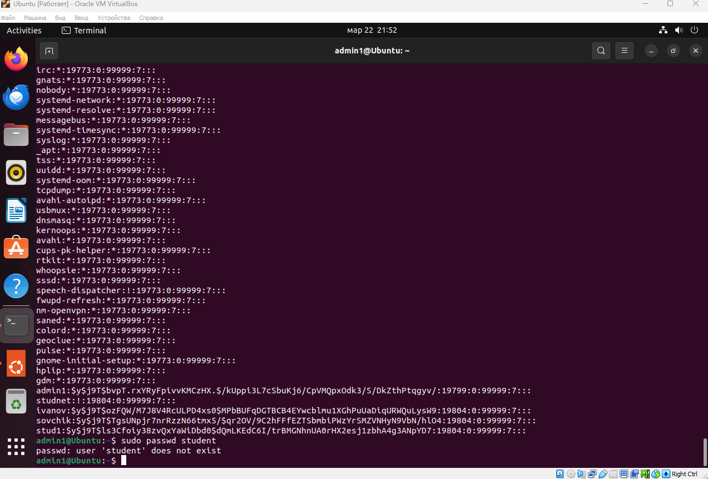
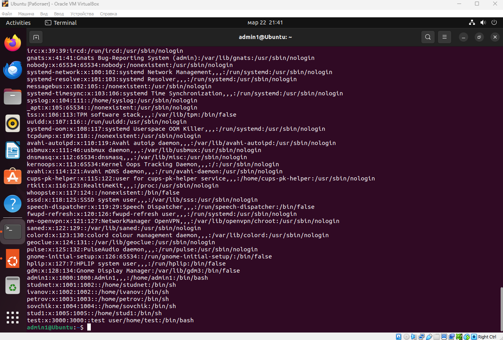
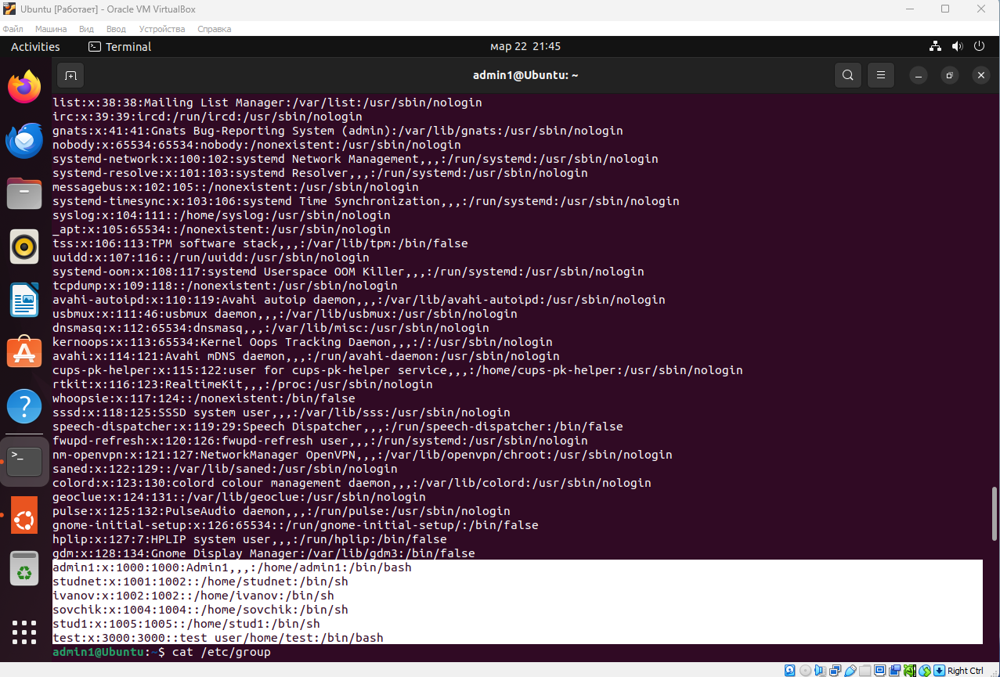
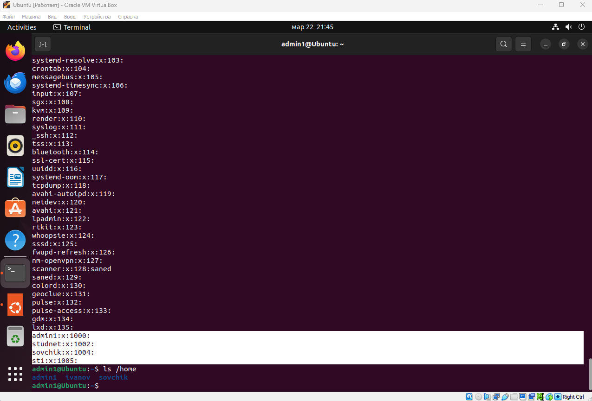

## /etc/passwd

## /etc/group

## /etc/shadow

## Создание пользователя в ручную

## Удаление Petrov

## Контрольные вопросы

1. Опишите основные команды создания и редактирования пользователей.  
useradd, usermod, userdel
2. Опишите основные команды создания и редактирования групп.  
groupadd, groupmod, groupdel
3. Опишите формат файла /etc/passwd.  
    - account – имя пользователя;
    - password – пароль пользователя;
    - UID – идентификационный номер пользователя;
    - GID – идентификационный номер основной группы пользователя;
    - GECOS – необязательное поле, используемое для указания дополнительной информации о пользователе (например, полное имя пользователя);
    - directory – домашний каталог ($HOME) пользователя;
    - shell – командный интерпретатор пользователя (часто /bin/sh).
4. Опишите формат файла /etc/shadow.
    - Имя пользователя
    - Зашифрованный пароль
    - Цифровой идентификатор пользователя (UID)
    - Цифровой идентификатор группы пользователя (GID)
    - Полное имя пользователя (GECOS)
    - Домашний каталог пользователя
    - Оболочка входа в систему
5. Опишите формат файла /etc/group.  
    - имя группы;
    - идентификатор группы (GID);
    - список пользователей, входящих в группу.
6. Опишите формат файла /etc/gshadow.
    - имя группы;
    - зашифрованный пароль;
    - администраторы через запятую;
    - обычные пользователи через запятую.
7. Что содержится в каталоге /etc/skel?  

В каталоге хранятся файлы, которые необходимы каждому пользователю, имеющему свой домашний каталог. При создании учетной записи все файлы данного каталога автоматически копируются в домашний каталог нового пользователя. Все файлы скрытые.

8. Опишите процесс регистрации пользователя вручную, путем редактирования конфигурационных файлов.

Чтобы вручную добавить нового пользователя в систему в
файл /etc/passwd, добавьте следующую строку:
testuser:x:3000:3000:test user:/home/testuser:/bin/bash
Добавлен пользователь «testuser» с идентификатором 3000.

Пользователь добавлен в группу с таким же идентифика-
тором, которая еще не создана. У пользователя установлен

комментарий, гласящий «test user», домашний каталог
установлен как "/home/testuser", а командная оболочка
– как "/bin/bash". Cохраните файл.

9. Для чего предназначены файлы /etc/profile и $HOME/.profile.

Информация файла профиля /etc/profile используется при
входе в систему каждого пользователя. Этот файл обычно
содержит:
- глобальные или локальные переменные среды;
- информацию о пути к файлам в переменной PATH;
- параметры терминала;
- меры безопасности;
- советы дня или сведения о причинах отказа.

После выполнения /etc/profile пользователь попадает в
свой домашний каталог $HOME. В этом каталоге хранится вся личная информация пользователя. Если в $HOME имеется файл .profile, система использует его в качестве исходного файла. Установки /etc/profile могут быть переопределены при добавлении в файл .profile нового элемента с другим значением либо при выполнении команды unset. Настройка файла .profile остается в распоряжении пользователя.